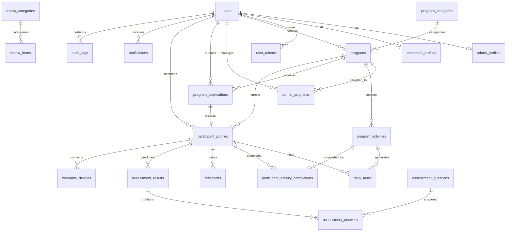

```mermaid
erDiagram
    users ||--o| admin_profiles : has
    users ||--o| interested_profiles : has
    users ||--o{ user_tokens : owns
    users ||--o{ programs : creates
    users ||--o{ admin_programs : manages
    users ||--o{ program_applications : submits
    users ||--o{ participant_profiles : becomes
    program_categories ||--o{ programs : categorizes
    programs ||--o{ admin_programs : assigned_to
    programs ||--o{ program_activities : contains
    programs ||--o{ program_applications : receives
    programs ||--o{ participant_profiles : enrolls
    program_applications ||--o| participant_profiles : creates
    participant_profiles ||--o{ daily_tasks : has
    participant_profiles ||--o{ participant_activity_completions : completes
    participant_profiles ||--o{ reflections : writes
    participant_profiles ||--o{ assessment_results : produces
    participant_profiles ||--o{ wearable_devices : connects
    program_activities ||--o{ daily_tasks : generates
    program_activities ||--o{ participant_activity_completions : completed_by
    assessment_questions ||--o{ assessment_answers : answered
    assessment_results ||--o{ assessment_answers : contains
    media_categories ||--o{ media_items : categorizes
    users ||--o{ notifications : receives
    users ||--o{ audit_logs : performs
```
